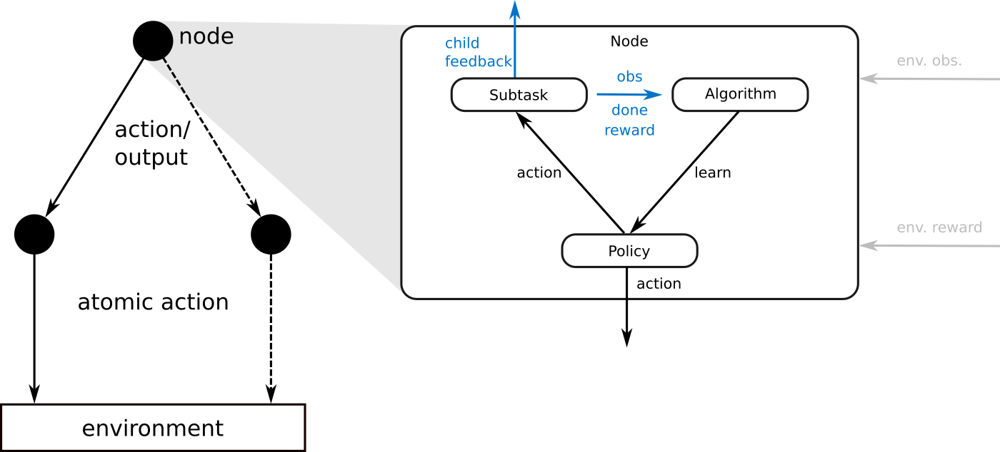

# Graph-RL

Graph-RL is a hierarchical reinforcement learning (HRL) framework that emphasizes modularity and flexibility. The user can define a hierarchy by specifying a directed graph where the nodes correspond to what is usually referred to as level or layer in the literature. Each node consists of an algorithm (responsible for learning), a subtask (responsible for observation, goal and reward generation) and a policy (generates the output of the node). This design allows the user to tailor a hierarchy to a reinforcement learning environment and unlocks the modularity inherent in HRL.



When evaluating the hierarchical policy, the graph is traversed from the root node to one of the leaf nodes. In general, the output of the parent node modulates the policy of the child node. In case of more than one child node, the policy of the parent node chooses which edge to follow. When a leaf node is reached, an atomic action from the action space of the environment is sampled.

The child nodes that have been traversed in this forward pass can then report back feedback to their parent nodes. This backward pass enables hindsight operations during learning (e.g. hindsight action relabeling).

Every node that has been traversed (starting from the leaf node that sampled the atomic action) can furthermore decide whether to return control to its parent or stay active (in which case the forward pass in the next environment step will start there). Control can also be reclaimed by every traversed parent node, e.g., if it achieved its subgoal.

## Installation

With python3.7 or higher run

```bash
pip install graph_rl
```

## Usage

Using Graph-RL requires specifying the hierarchy via a graph. A way to get started quickly is to use graph classes that automatically generate the whole graph when provided with the subtask specifications for each node. Alternatively, a graph can be constructed manually by instantiating nodes and defining parent child relations. Please refer to the scripts provided in the `demos` folder for further information.

At the moment the algorithms "Hierarchical Actor-Critic" (HAC) and "Hierarchical reinforcement learning with Timed Subgoals" (HiTS) are available.


